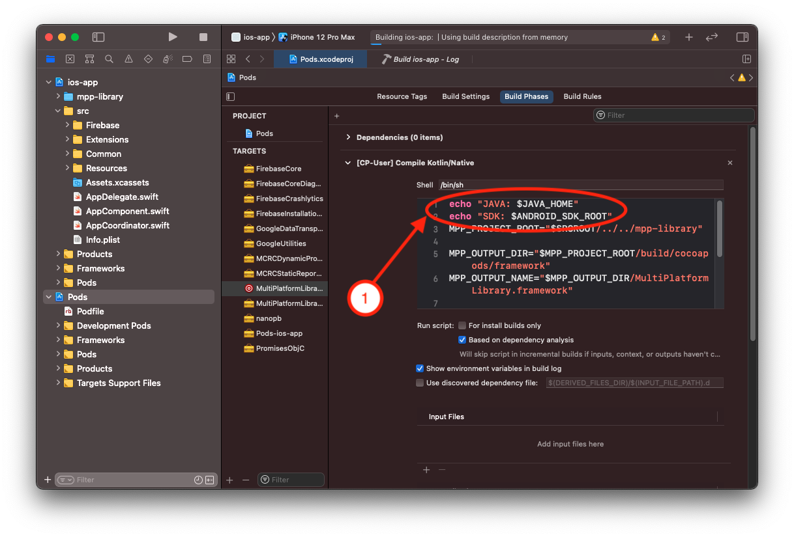
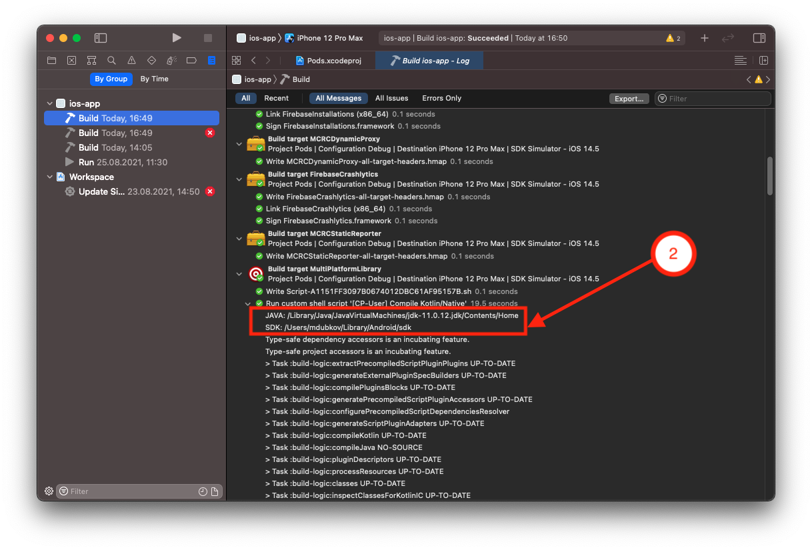

# Mobile Kotlin doctor
This is a script for KMM developers that allows you to check whether your working environment is configured. 

# DEPRECATION ALERT
Kotlin already have own doctor application - [kdoctor](https://github.com/Kotlin/kdoctor), so please use kdoctor instead of moko-doctor.

## What does the *doctor* check?
- Is *Git* installed
- Is *XCode* / *Xcode Command Line* installed
- Is *Android Studio* installed
- Is *Cocoa Pods* installed
- is *Xcode* configured
- is *Android Studio* configured
- is the *environment variables* installed


## Usage

Clone the repository for yourself and run the script:

```bash
./doctor.sh
```

or you can install it with the command:

```bash
/bin/bash -c "$(curl -fsSL https://raw.githubusercontent.com/icerockdev/moko-doctor/main/install_doctor.sh)"
```

## How do we set up the environment?

You can take a short lesson on setting up the environment [here](https://codelabs.kmp.icerock.dev/codelabs/kmm-icerock-onboarding-1-ru/index.html#1).

## Xcode environments

In our projects, we run the *Gradle* build from *Xcode*. At the start of the build, the [*Gradle Daemon*](https://docs.gradle.org/current/userguide/gradle_daemon.html) is also launched. 
If there are several *JDKs* on the computer, *Xcode* starts the build from the highest version.

The reason is that a shell ran from *Xcode* build phase is [non-interactive shell](https://www.vanimpe.eu/2014/01/18/different-shell-types-interactive-non-interactive-login/).

In order for Xcode to see the *JAVA_HOME* and *ANDROID_SDK_ROOT* variables that we have declared, you need to run the script:

```bash
./setup_xcode_environment.sh
```

This script passes:
- *JAVA_HOME* 
- *ANDROID_SDK_ROOT* 
- *GRADLE_USER_HOME*
- *KONAN_DATA_DIR*

variables specified in your environment (in .zshrc or .bash-profile) to the *Xcode* environment , which is launched when the project is built.

After rebooting the system, it can check this, it is enough to enter a couple of lines of build phases.



Run the project build using *Cmd+B*. 

In *Build* we see:



